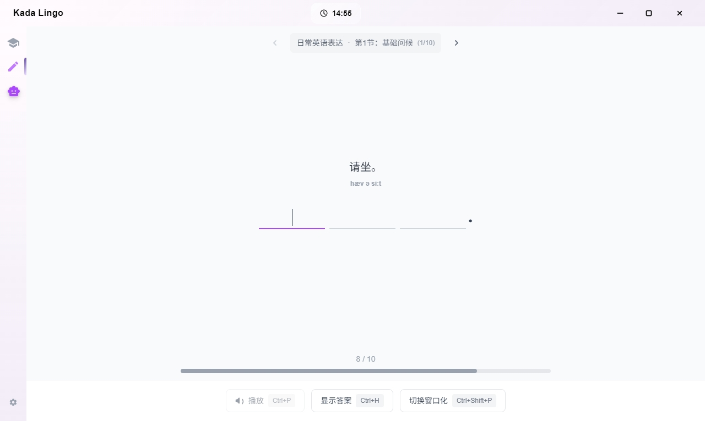
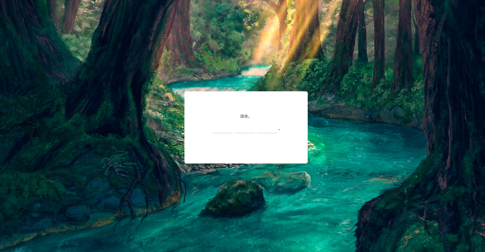
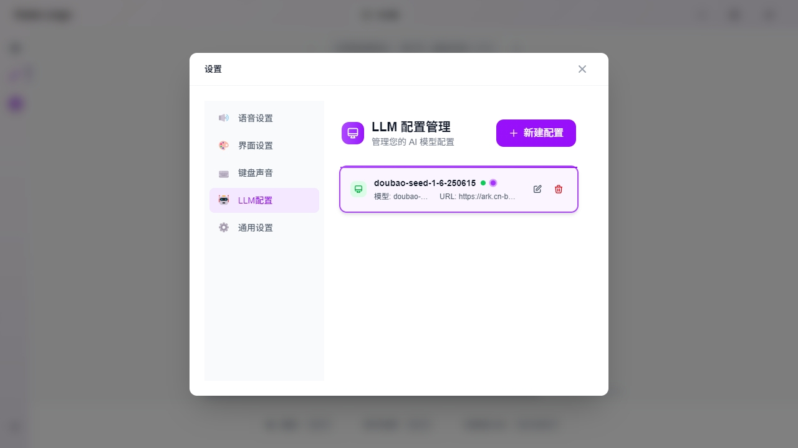

# 咔哒英语

🚀 基于 Electron + React + TypeScript 构建的语言学习桌面应用程序

## 功能特色

- 📝 **句子翻译练习** - 中英文互译
- 🔊 **语音合成** - TTS语音播放功能
- 🎨 **Material Design 3** - 现代化界面设计
- 💾 **本地存储** - 基于 IndexedDB 的离线数据存储

## 应用截图

### 课程中心


### 练习模式


### 浮窗模式


### 设置页面



### AI课程生成


## 技术栈

- Electron + React + TypeScript
- Vite 
- Tailwind CSS
- IndexedDB (Dexie)

## 快速开始

### 环境要求
- Node.js >= 20.0.0
- npm >= 8.0.0

### 安装运行
```bash
# 克隆项目
git clone https://github.com/JianWang97/kadalingo.git
cd kadalingo

# 安装依赖
npm install

# 启动应用
npm start
```

### 构建打包
```bash
# 构建应用
npm run build

# 生成安装包
npm run dist
```

## 项目结构

```
src/
├── main/               # Electron 主进程
├── renderer/           # React 渲染进程
├── components/         # React 组件
├── data/              # 数据管理
├── hooks/             # 自定义 Hooks
├── page/              # 页面组件
└── services/          # 业务服务
```

## 开发

```bash
# 代码检查
npm run lint

# 类型检查
npm run type-check
```

## 许可证

GPL-3.0 License

---

⭐ 如果这个项目对您有帮助，请给个 Star 支持一下！
